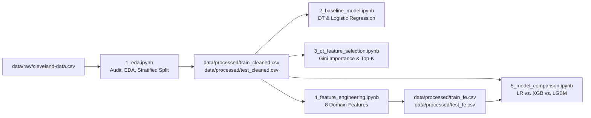

# Cleveland Heart Disease Classification & Feature Engineering Benchmark

[](pyproject.toml)
[](https://github.com/astral-sh/uv)
[](pyproject.toml)
[]()

An machine learning benchmark evaluating predictive performance for coronary artery disease on the clinical **Cleveland Heart Disease** dataset. 

This repository systematically benchmarks linear models (**Logistic Regression**) against gradient-boosted decision tree ensembles (**XGBoost**, **LightGBM**, and **Decision Trees**), rigorously evaluating the impact of domain-driven interaction terms, clinical ratios, and categorical feature engineering under strict cross-validation.

> [!NOTE]
> **Project Scope**: This repository is designed for **learning and experimenting with machine learning concepts** (exploratory data analysis, validation methodology, feature engineering, and model evaluation). It is **not** an end-to-end production system—it does not include production infrastructure such as Docker containers, REST APIs, or deployment pipelines. The entire study is implemented and explored purely through reproducible Jupyter notebooks.

---

## Table of Contents

- [Executive Summary & Benchmark Results](#executive-summary--benchmark-results)
- [Dataset & Clinical Feature Dictionary](#dataset--clinical-feature-dictionary)
- [Workflow & Pipeline Architecture](#workflow--pipeline-architecture)
  - [1. Exploratory Data Analysis](#1-exploratory-data-analysis-1_edaipynb)
  - [2. Baseline Modeling](#2-baseline-modeling-2_baseline_modelipynb)
  - [3. Decision Tree Feature Selection](#3-decision-tree-feature-selection-3_dt_feature_selectionipynb)
  - [4. Domain Feature Engineering](#4-domain-feature-engineering-4_feature_engineeringipynb)
  - [5. Model Comparison & Diagnostics](#5-model-comparison--diagnostics-5_model_comparisonipynb)
- [Data Leakage Prevention Protocol](#data-leakage-prevention-protocol)
- [Repository Structure](#repository-structure)
- [Environment Setup & Quickstart](#environment-setup--quickstart)
- [References & Citations](#references--citations)

---

## Executive Summary & Benchmark Results

All models were evaluated using **Stratified 5-Fold Cross-Validation** on the training partition ($N=242$) and independently validated on an untouched **Held-Out Test Set** ($N=61$, 20% holdout with identical disease prevalence). Preprocessing transformations (imputation, scaling, encoding) were fitted strictly within each training fold to eliminate data leakage.

### Comparative Performance Synthesis

| Model | Feature Setup | CV Accuracy | CV F1-Score | CV ROC-AUC | Test Accuracy | Test F1-Score | Test ROC-AUC |
| :--- | :--- | :---: | :---: | :---: | :---: | :---: | :---: |
| **Logistic Regression** | Baseline (Cleaned) | **0.8471** | **0.8245** | **0.9025** | 0.8852 | 0.8814 | **0.9665** |
| | Post-Feature Engineering | 0.8347 | 0.8143 | 0.8898 | 0.8689 | 0.8667 | 0.9621 |
| **XGBoost** | Baseline (Cleaned) | 0.8058 | 0.7819 | 0.8780 | **0.9180** | **0.9153** | 0.9524 |
| | Post-Feature Engineering | 0.7892 | 0.7661 | 0.8903 | 0.9016 | 0.8966 | **0.9654** |
| **LightGBM** | Baseline (Cleaned) | 0.8057 | 0.7808 | 0.8838 | 0.9016 | 0.8966 | 0.9600 |
| | Post-Feature Engineering | 0.8056 | 0.7854 | **0.8935** | 0.9016 | 0.8966 | 0.9610 |

### Key Experimental Insights

1. **High Generalization for Tree Ensembles**: Tree-based models (**XGBoost** and **LightGBM**) achieve superior generalization on the held-out test set ($\ge 90.16\%$ Accuracy, $\ge 0.8966$ F1-Score), substantially outperforming their internal cross-validation scores due to effective regularization against sample noise.
2. **Impact of Engineered Feature Interactions**: Tree models prominently leveraged the engineered pair interactions (`cp_thal_4_7.0`, `ca_exang_0.0_0`) and physiological ratios (`hr_per_age`), directly isolating high-risk patient subgroups without requiring deep, high-variance tree splits.
3. **Linear Parsimony vs. Interaction Dimensionality**: **Logistic Regression** on baseline features is an extraordinarily robust, low-variance classifier, attaining the top CV Accuracy (**84.71%**) and top Test ROC-AUC (**0.9665**). Adding interaction terms slightly diluted linear performance due to increased feature dimensionality relative to sample size ($N=242$).
4. **Clinical Recommendation**:
   - For **maximum test accuracy and non-linear risk group separation**: **XGBoost / LightGBM** with engineered interactions.
   - For **parsimony, calibrated probabilities, and clinical interpretability**: **Logistic Regression** on standard clinical covariates.

---

## Dataset & Clinical Feature Dictionary

The dataset originates from the **Cleveland Clinic Foundation** (available via the [UCI Machine Learning Repository](https://archive.ics.uci.edu/dataset/45/heart+disease)). It records 303 patient admissions with angiographic disease diagnoses.

The prediction target is angiographic coronary artery disease:
- `0`: Normal angiogram ($< 50\%$ diameter stenosis)
- `1`: Heart disease present ($> 50\%$ diameter stenosis in at least one major vessel)

| Feature | Role | Type | Clinical Description | Encodings / Range | Units | Missing |
| :--- | :--- | :--- | :--- | :--- | :---: | :---: |
| `age` | Predictor | Continuous | Patient age | 29 – 77 | Years | None |
| `sex` | Predictor | Binary | Biological sex | `0` = Female, `1` = Male | — | None |
| `cp` | Predictor | Categorical | Chest pain type | `1` = Typical angina<br>`2` = Atypical angina<br>`3` = Non-anginal pain<br>`4` = Asymptomatic | — | None |
| `trestbps` | Predictor | Continuous | Resting blood pressure on hospital admission | 94 – 200 | mm Hg | None |
| `chol` | Predictor | Continuous | Serum cholesterol | 126 – 564 | mg/dL | None |
| `fbs` | Predictor | Binary | Fasting blood sugar > 120 mg/dL | `0` = False, `1` = True | — | None |
| `restecg` | Predictor | Categorical | Resting electrocardiographic results | `0` = Normal<br>`1` = ST-T wave abnormality<br>`2` = Left ventricular hypertrophy | — | None |
| `thalach` | Predictor | Continuous | Maximum heart rate achieved during exercise | 71 – 202 | bpm | None |
| `exang` | Predictor | Binary | Exercise-induced angina | `0` = No, `1` = Yes | — | None |
| `oldpeak` | Predictor | Continuous | ST depression induced by exercise relative to rest | 0.0 – 6.2 | mm | None |
| `slope` | Predictor | Categorical | Slope of peak exercise ST segment | `1` = Upsloping<br>`2` = Flat<br>`3` = Downsloping | — | None |
| `ca` | Predictor | Ordinal | Major vessels ($0–3$) colored by fluoroscopy | 0, 1, 2, 3 | Count | 4 cases |
| `thal` | Predictor | Categorical | Thallium scintigraphy stress test result | `3` = Normal<br>`6` = Fixed defect<br>`7` = Reversible defect | — | 2 cases |
| `target` | **Target** | Binary | Angiographic disease status | `0` = Absence, `1` = Presence | — | None |

---

## Workflow & Pipeline Architecture

The benchmark is decomposed across five focused Jupyter notebooks in the `notebook/` directory:



### 1. Exploratory Data Analysis ([`1_eda.ipynb`](notebook/1_eda.ipynb))
- **Data Quality & Audit**: Verified data types and flagged missingness (`ca`: 4 missing, `thal`: 2 missing; marked as `?`). Evaluated outliers via 1.5×IQR across `trestbps`, `chol`, `thalach`, and `oldpeak`; verified values are clinically plausible and preserved.
- **Univariate & Bivariate Patterns**: Identified primary discriminative signals:
  - Strongest univariate separation: `thalach` (lower in disease cases) and `oldpeak` (elevated ST depression).
  - Categorical association: `cp` (asymptomatic type 4 exhibits highest disease rate), `ca` (monotonic increase with fluoroscopy vessel count), `thal` (reversible defects strongly predictive), and `exang` (exercise-induced angina).
- **Multivariate Interplay**: Discovered marked cross-feature risk stratification, notably `ca × exang` and `cp × thal`.
- **Stratified Partitioning**: Executed an 80/20 stratified split (`random_state=42`) producing `train_cleaned.csv` ($N=242$) and `test_cleaned.csv` ($N=61$).

### 2. Baseline Modeling ([`2_baseline_model.ipynb`](notebook/2_baseline_model.ipynb))
- Established benchmark baselines using un-tuned **Decision Tree** vs. **Logistic Regression**.
- Enforced clean Scikit-Learn `Pipeline` architectures with `SimpleImputer` (median for numeric, mode for categorical), `StandardScaler`, and `OneHotEncoder(handle_unknown='ignore')`.
- Logistic Regression established a strong initial benchmark: **84.71% CV Accuracy**, **0.8245 F1**, and **0.9025 ROC-AUC**.

### 3. Decision Tree Feature Selection ([`3_dt_feature_selection.ipynb`](notebook/3_dt_feature_selection.ipynb))
- Evaluated Gini feature importance rankings from tree fits.
- Identified top predictive predictors: `thal`, `cp`, `ca`, `oldpeak`, `chol`, `age`, and `thalach`.
- Analyzed the trade-off of constraining predictors to top-$K$ subsets.

### 4. Domain Feature Engineering ([`4_feature_engineering.ipynb`](notebook/4_feature_engineering.ipynb))
Engineered 8 domain-specific features based on pathophysiological rationale and EDA discoveries:
- **Pair Interaction Encodings**:
  - `ca_exang`: Composite category combining fluoroscopy vessel count and exercise angina.
  - `cp_thal`: High-risk risk-stratum combining chest pain category and thallium defect category.
- **Continuous Interaction Products**:
  - `thalach_exang`: Modulates maximum heart rate conditioned on angina presence.
  - `oldpeak_exang`: Compounded exertional ischemia interaction.
- **Physiological Age Ratios**:
  - `chol_per_age`: Age-adjusted serum cholesterol ratio.
  - `bps_per_age`: Age-adjusted resting systolic blood pressure.
  - `hr_per_age`: Maximum heart rate achieved normalized by age ($HR_{max} / Age$).
- **Non-Linear Age Discretization**:
  - `age_bin`: Age segmented into clinical risk tiers (`<40`, `40–49`, `50–59`, `60–69`, `70+`).

Datasets with engineered features were exported to `train_fe.csv` and `test_fe.csv`.

### 5. Model Comparison & Diagnostics ([`5_model_comparison.ipynb`](notebook/5_model_comparison.ipynb))
- Comprehensive benchmark comparing **Logistic Regression**, **XGBoost**, and **LightGBM** across both baseline and engineered feature spaces.
- Extracted diagnostic ROC curves and feature importance profiles:
  - Top XGBoost splits post-FE: `cp_thal_4_7.0`, `ca_exang_0.0_0`, and `hr_per_age`.
  - Logistic Regression maintained calibrated probability estimates with test ROC-AUC $> 0.96$.

---

## Data Leakage Prevention Protocol

Data leakage is a frequent pitfall in biomedical ML studies. This project implements strict boundaries:

1. **Split-Before-Transform**: Stratified train/test splitting occurs in `1_eda.ipynb` prior to computing scaling parameters, imputation statistics, or one-hot category maps.
2. **Pipeline Encapsulation**: Missing value imputers (`SimpleImputer`) and feature scalers (`StandardScaler`) are encapsulated inside `sklearn.pipeline.Pipeline` or `sklearn.compose.ColumnTransformer`. Parameters ($\mu, \sigma$, median, modes) are computed purely from training folds during cross-validation.
3. **Deterministic Feature Construction**: Feature engineering transforms applied in `4_feature_engineering.ipynb` are pure column-wise mathematical operations that do not leak global distributional statistics.

---

## Repository Structure

```text
cleveland-heart-disease/
├── data/
│   ├── raw/
│   │   └── cleveland-data.csv          # Original 303-row UCI dataset (unmodified)
│   └── processed/
│       ├── train_cleaned.csv           # 80% train split (cleaned, base 13 features)
│       ├── test_cleaned.csv            # 20% holdout test split (cleaned, base 13 features)
│       ├── train_fe.csv                # 80% train split (with 8 engineered features)
│       └── test_fe.csv                 # 20% holdout test split (with 8 engineered features)
├── notebook/
│   ├── 1_eda.ipynb                     # EDA, distribution checks, quality audit, train/test split
│   ├── 2_baseline_model.ipynb          # Baseline models (Decision Tree & Logistic Regression)
│   ├── 3_dt_feature_selection.ipynb    # Tree feature importances & Top-K evaluation
│   ├── 4_feature_engineering.ipynb     # Feature construction & preliminary tree validation
│   └── 5_model_comparison.ipynb        # Final multi-model comparison (LR vs. XGB vs. LightGBM)
├── main.py                             # Verification entrypoint
├── pyproject.toml                      # Project metadata and pinned dependencies
├── uv.lock                             # Reproducible lockfile (uv package manager)
├── .python-version                     # Python runtime specification (>=3.14)
├── .gitignore                          # Standard git ignore configuration
└── README.md                           # Project documentation
```

---

## Environment Setup & Quickstart

This project is configured with modern Python packaging via [`uv`](https://github.com/astral-sh/uv).

### Prerequisites
- Python `3.14+` (or compatible Python 3.11+ environment)
- [`uv`](https://docs.astral.sh/uv/) (recommended) or standard `pip`

### Option 1: Quickstart with `uv` (Recommended)

1. **Clone the repository:**
   ```bash
   git clone https://github.com/LouisTran1701/cleveland-heart-disease.git
   cd cleveland-heart-disease
   ```

2. **Sync the virtual environment and dependencies:**
   ```bash
   uv sync
   ```

3. **Launch Jupyter Lab:**
   ```bash
   uv run jupyter lab
   ```

4. **Verify environment execution:**
   ```bash
   uv run python main.py
   ```

### Option 2: Setup with standard `pip` & `venv`

```bash
python3 -m venv .venv
source .venv/bin/activate
pip install -e .
jupyter lab
```

---

## References & Citations

1. **UCI Machine Learning Repository**:
   - Janosi, A., Steinbrunn, W., Pfisterer, M., & Detrano, R. (1988). *Heart Disease Data Set*. UCI Machine Learning Repository. [https://archive.ics.uci.edu/dataset/45/heart+disease](https://archive.ics.uci.edu/dataset/45/heart+disease)
2. **Clinical Study Source**:
   - Detrano, R., Janosi, A., Steinbrunn, W., Pfisterer, M., Schmid, J. J., Sandhu, S., Gopalakrishna, K. X., & Guppy, K. H. (1989). *International application of a new probability algorithm for the diagnosis of coronary artery disease*. The American Journal of Cardiology, 64(5), 304–310.
3. **Libraries**:
   - Scikit-learn: Pedregosa et al., *Scikit-learn: Machine Learning in Python*, JMLR 12, pp. 2825-2830, 2011.
   - XGBoost: Chen, T., & Guestrin, C., *XGBoost: A Scalable Tree Boosting System*, KDD 2016.
   - LightGBM: Ke, G. et al., *LightGBM: A Highly Efficient Gradient Boosting Decision Tree*, NeurIPS 2017.
